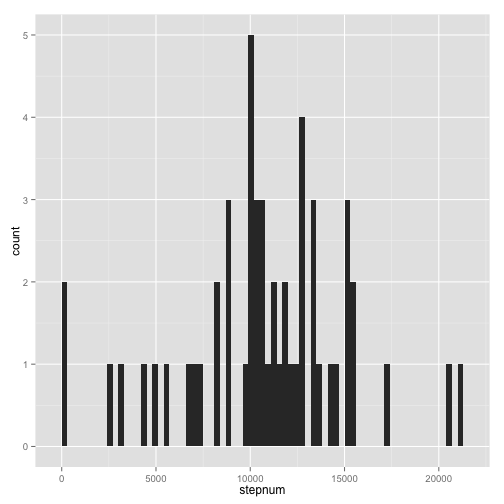

# Reproducible Research: Peer Assessment 1


## Loading and preprocessing the data

```r
data <- read.csv("/Users/xiangjiang/Documents/git/RepData_PeerAssessment1/activity.csv")
```


## What is mean total number of steps taken per day?
### Make a histogram of the total number of steps taken each day

```r
library(ggplot2)
## Using tapply to calculate sum steps per day
steps <- tapply(data$steps, data$date, sum)
dfsteps <- data.frame(names(steps), steps, row.names = NULL)
names(dfsteps) <- c("date", "stepnum")
## Using qplot to plot histogram
qplot(stepnum, data = dfsteps, geom = "histogram", binwidth = 300)
```

 

### Calculate and report the mean and median total number of steps taken per day
Mean steps taken per day:

```r
mean(steps, na.rm = TRUE)
```

```
## [1] 10766
```


Median steps taken per day:

```r
median(steps, na.rm = TRUE)
```

```
## [1] 10765
```


## What is the average daily activity pattern?


## Imputing missing values


## Are there differences in activity patterns between weekdays and weekends?
